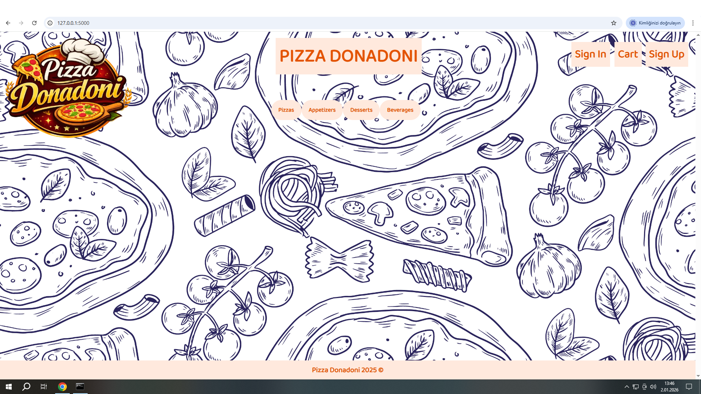
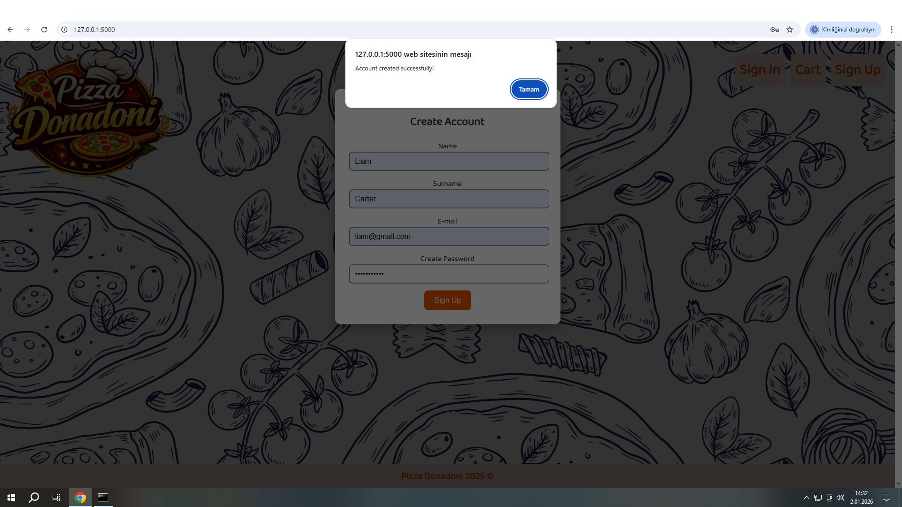
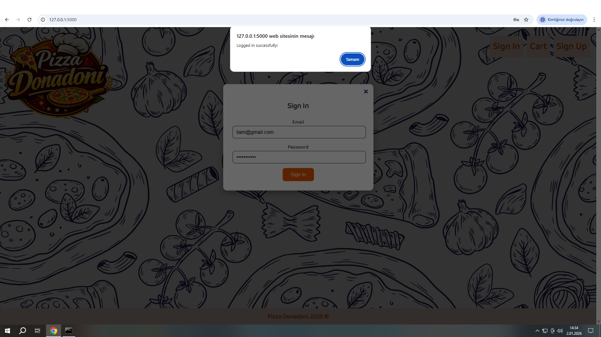
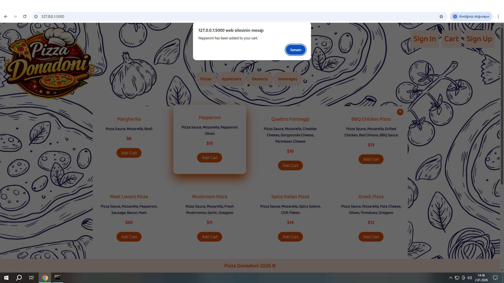
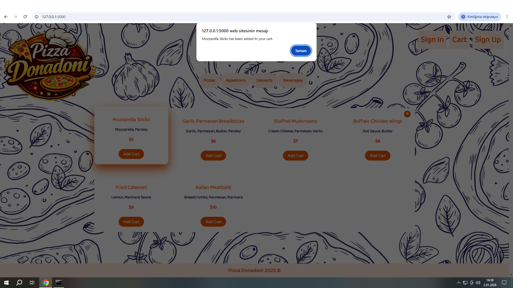
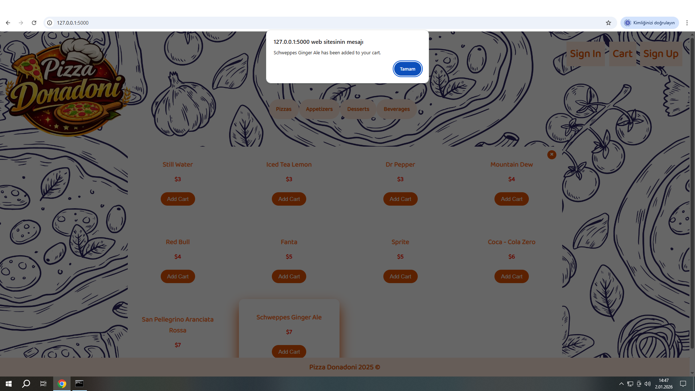
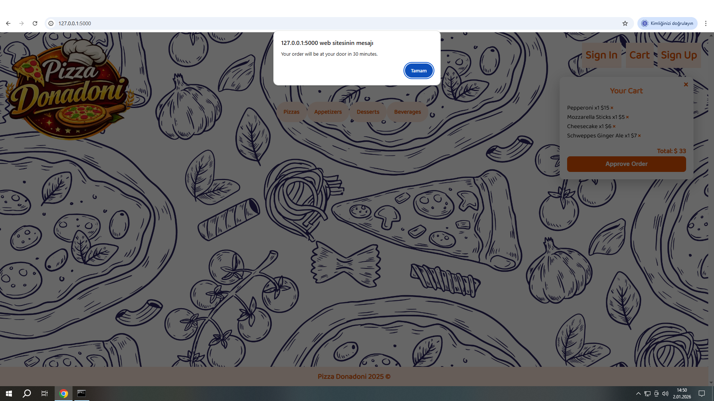

# PIZZA DONADONI HOME PAGE

This website represents an online ordering platform for a pizza restaurant. Users can create an account log in with their credentials and place orders through the system.

 

  

## CREATE ACCOUNT

First users create an account to introduce themselves on the Pizza Donadoni restaurant’s online ordering website.

 

  

## LOGIN

After creating an account users can log in to the website using the registered email address and password.

 

  

## PIZZA ORDER

Each selected pizza from the Pizza menu is added to the cart and the total price is calculated automatically.

 

  

## APPETIZERS ORDER

Each selected item from the Appetizers menu is added to the cart and the total price is calculated automatically.

 

  

## DESSERTS ORDER

Each selected dessert from the Desserts menu is added to the cart and the total price is calculated automatically.

 

  

## BEVERAGES ORDER

Each selected beverage from the Beverages menu is added to the cart and the total price is calculated automatically.

 

  

## APPROVE ORDER

In the cart section users can add items from the menus without any limit view the listed prices and see the total payment amount calculated automatically.

 

  
